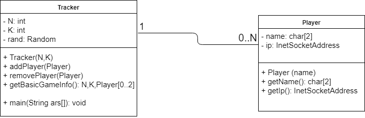

# Tracker Program

## Responsibilities
1. First Point of Contact
2. Maintain an up to date list of players
3. Return random player IPs [0-2] & N,K when asked for
4. At bootstrap:
	1. Spawn a single instance of RMI registry at the given port
	2. Register a single instance of itself with this registry 

## Class Diagram

## Details
- Single instance of Tracker 
- Maintain a list of 0 or More Players
- Will be maintained inside a RMI registry (to be used as a remote object)

## Flows
### 1. First Player joins
### 2. Subsequent player joins
### 3. Player exit
### 4. Player Crash

## Issues
### 1. Race Condition when first player joins

a) Player A asks tracker about basicGameInfo(). It receives the reply saying no players present.

b) Player B also asks tracker at about same time (Before Player A has registered)

c) Player A calls add method and declares itself as primary server. Also at the same time, Player B call add method on tracker and declares itself as primary server.

d) Although the primary server declaration can be solved, IF the tracker returns the list of servers even while calling Add. However, if both the initial players have same Player ID, it will be a problem.

### 2. Player crashes and immediately tries to rejoin
a) Player X crashes

b) Someone pings X and informs the server that X is dead

c) In the meanwhile X contacts the tracker again, saying it wants to rejoin. But X has not been yet removed from the Tracker's player list. 
#### Solution
- Tracker doesn't decide unique Player ID or not?
- Let two people call ADD for a single player? 
- 
